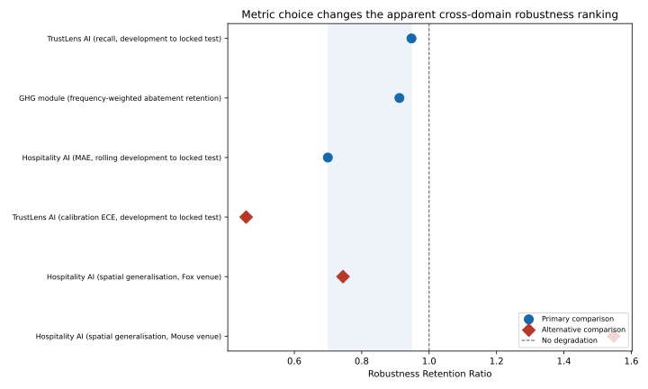

# Cross-Domain Robustness Synthesis

[](https://github.com/akshith2001/cross-domain-robustness-synthesis/actions/workflows/ci.yml)
[](LICENSE)
[](pyproject.toml)

> **Related work:** this project synthesises already-published results from
> [`trustlens-ai`](https://github.com/akshith2001/trustlens-ai) (credit-risk
> classification), [`ghg-scenario-model`](https://github.com/akshith2001/ghg-scenario-model)
> (climate/energy optimisation), and
> [`hospitality-sustainability-ai`](https://github.com/akshith2001/hospitality-sustainability-ai)
> (building-energy forecasting), testing whether a single robustness metric
> can meaningfully compare "degradation under stress" across all three.

**Important:** this is a research synthesis, not a new predictive model.
TrustLens and Hospitality inputs are taken from their released result
documents. The GHG ratio is deterministically re-derived from its released
code and data (1,000 samples, seed 2026, target 2,500 kg CO2e). No source
model is retrained. The versioned [source manifest](src/cross_domain_robustness/source_metrics.json)
makes every input and provenance note auditable.

## Research question

Can "robustness under stress" be summarised as a single retention ratio
that is comparable across independently designed, independently evaluated
machine-learning systems, or does this comparison collapse once you check
whether it survives an equally defensible alternative choice of comparison
within the same domain?

## Headline finding

Using the single most natural stress comparison already present in each
project's own evaluation design, the three projects appear to form a clean,
publishable-looking ranking:

| Domain | Comparison | Robustness Retention Ratio |
|---|---|---|
| TrustLens AI | Development recall → locked test recall | **0.948** |
| GHG scenario model | Nominal abatement → frequency-weighted retained abatement | **0.912** |
| Hospitality Sustainability AI | Rolling-development MAE → locked test MAE | **0.700** |

Substituting an equally valid, equally non-cherry-picked *alternative*
comparison already reported by the same projects:

| Domain | Alternative comparison | RRR |
|---|---|---|
| TrustLens AI | Development ECE → locked test ECE (calibration) | **0.457** |
| Hospitality AI | Unseen-venue → unseen-venue-and-future-period, Fox venue | **0.745** |
| Hospitality AI | Unseen-venue → unseen-venue-and-future-period, Mouse venue | **1.548** |

The naive comparison's range was 0.700–0.948 (spread 0.248). With the
alternatives included, the range becomes 0.457–1.548 (spread 1.091) —
**more than four times wider**. TrustLens AI moves from *most* robust
(0.948, by recall) to *least* robust (0.457, by calibration) depending
purely on which already-published metric is used for the identical
development-to-locked-test comparison. One venue (Mouse_lodging_Vicente)
shows RRR > 1: the model performed *better* under the strictly harder,
doubly-stressed condition, an honest anomaly this synthesis reports rather
than hides.



## Why this happens, and what it implies

"Robustness" is not one construct. Discrimination, calibration, temporal
generalisation, spatial generalisation, and parameter-uncertainty
robustness are logically separate axes, and each project's own governance
design already treats them separately within its own domain (TrustLens's
locked precedence rules; the GHG model's rank-reversal analysis;
Hospitality's separate temporal/spatial generalisation tests). A single
cross-domain retention ratio necessarily collapses one of these axes and
silently privileges whichever metric happens to get chosen, reintroducing
at the cross-domain level exactly the failure mode each project's own
governance layer was built to prevent within its domain. A defensible
cross-domain benchmark would need to report a small **vector** of named,
domain-appropriate scores rather than one aggregated number.

## Reproduce

```bash
python -m pip install -e ".[figures]"
python -m unittest discover -s tests -v
python -m cross_domain_robustness --output results/reference_synthesis.json
python figures/plot_spread.py
```

The automated tests include direct checks of the paper's central
claim (`TestCoreClaim` in `tests/test_synthesis.py`): that the full range
including alternative comparisons is at least double the naive range, and
that TrustLens AI's ranking flips between the two metric choices. GitHub
Actions repeats the tests and figure generation on Python 3.10 and 3.12.

## Limitations

- This synthesis draws on three research prototypes built by one author
  with related design philosophies; it does not sample the space of
  possible ML systems or domains, and the specific spread reported here
  is illustrative of the phenomenon, not a general-purpose estimate of how
  much metric choice matters in general.
- Only one alternative comparison per domain was tested where available; a
  fuller study would enumerate all defensible within-domain comparisons
  systematically.
- TrustLens and Hospitality values come from released result documents. The
  GHG selection frequencies are deterministically re-derived from released
  code/data because the exact intermediate frequencies were not all printed
  in its narrative report. This distinction is recorded in the source manifest.

See [`docs/cross_domain_robustness_synthesis.md`](docs/cross_domain_robustness_synthesis.md)
for the full write-up, including the reasoning connecting this finding to
what a defensible cross-domain trustworthy-AI evaluation framework would
require.

## License

MIT
